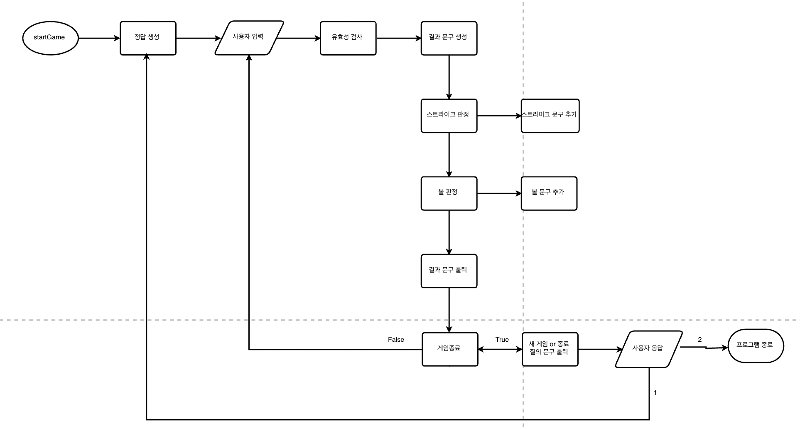

# 숫자 야구 게임(1주차 미션) - 이주형

## ⚾ 구현 기능 목록

1. 정답 숫자 생성
  - 임의의 3자리 랜덤 숫자 생성
  - 각 자리는 1~9 시이의 숫자로 이루어짐
  - 각 자리는 서로 다른 숫자로 이루어짐
  - [x] camp.nextstep.edu.missionutils.Randoms의 pickNumberInRange() 활용

2. 입력
  - 3자리 수 입력
  - 잘못된 숫자일 경우 IllegalArgumentException 및 종료
    + [예외] 맨 앞자리가 0일때
    + [예외] 3자리 숫자가 아닐때
  - [x] camp.nextstep.edu.missionutils.Console의 readLine() 활용

3. 대조 및 판정
- 같은 자리 같은 숫자면 스트라이크
- 다른 자리 같은 숫자면 볼
- 전부 아니면 낫싱
- 정답이면 게임 종료

4. 종료
  - 숫자가 맞거나 잘못된 숫자를 입력했으면 한 게임 종료
  - 1 입력시 새로운 게임 시작
  - 2 입력시 프로그램 완전 종료

## 📍 유의사항

- 자바 코드 컨벤션을 지키면서 프로그래밍한다.
  - https://naver.github.io/hackday-conventions-java
- indent(인덴트, 들여쓰기) depth를 3이 넘지 않도록 구현한다. 2까지만 허용한다.
  - 예를 들어 while문 안에 if문이 있으면 들여쓰기는 2이다.
  - 힌트: indent(인덴트, 들여쓰기) depth를 줄이는 좋은 방법은 함수(또는 메소드)를 분리하면 된다.
- 3항 연산자를 쓰지 않는다.
- 함수(또는 메소드)가 한 가지 일만 하도록 최대한 작게 만들어라.
- 테스트 코드 두개 전부 통과 시켜야 한다.

## 📝 License

This project is [MIT](https://github.com/woowacourse/java-baseball-precourse/blob/master/LICENSE) licensed.
