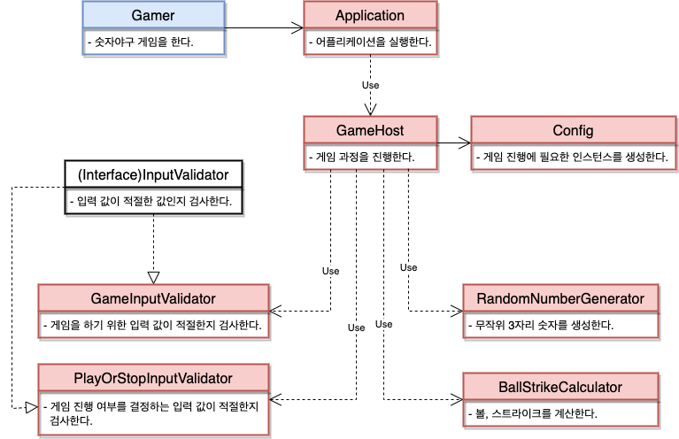

# 미션 - 숫자 야구 게임

## 🚀 어플리케이션 책임

- 숫자야구 게임을 실행한다.

## 🖇 객체들의 역할과 책임 그리고 협력

## 🗒 구현해야하는 객체, 기능 목록

> Application 객체

- 숫자 야구 어플리케이션을 실행시키는 기능

> GameHost 객체

- 숫자 야구 게임 프로세스를 진행하는 기능
    - 타겟 숫자를 생성 받아서 게이머가 입력한 값과 비교하고 결과를 반환 하는 기능
    - 비교 결과가 3스트라이크인 경우 게이머에게 게임 진행 여부를 묻고 진행 혹은 종료하는 기능

> Config 객체

- 게임 진행에 필요한 객체의 인스턴스를 생성하는 기능

> InputValidation 인터페이스 객체

- 입력값이 적절한지 검사하는 기능

> GameInputValidation 객체

- 게임을 하기 위한 입력값이 적절하지 않다면 예외를 발생시키는 기능

> PlayOrStopInputValidation 객체

- 게임 진행 여부를 결정하는 입력 값이 적절하지 않다면 예외를 발생시키는 기능

> BallStrikeCalculator 객체

- 볼, 스트라이크를 계산하는 기능
- 계산된 볼, 스트라이크 개수에 대한 정보를 문자열로 바꿔주는 기능

> RandomNumberGenerator 객체

- 무작위 3자리 숫자를 생성하는 기능
