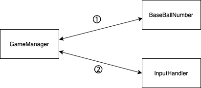

# 미션 - 숫자 야구 게임

## 🚀 기능 설계 전략

- 3개의 객체로 게임 기능을 구현하도록 설계했다.
- `GameManager` 는 게임 실행을 관리하는 객체이다. 후술할 연관 객체들과 정보를 주고받으며 게임을 계속 진행할지 관리한다.
- `BaseBallNumber` 는 야구게임 정답을 관리하는 객체이다. 정답 여부 확인, 힌트 생성, 번호 리셋과 같은 여러 메서드를 가지고 있다.
- `InputHandler` 는 야구게임에 사용되는 입력을 핸들링하며, 부적절한 입력에 대해 예외를 발생시킨다.
략

## 구현할 기능 목록

### GameManager
- 게임 시작 기능
- 게임 프로세스(객체들의 메서드를 적절한 순서로 호출) 진행 기능
- 사용자의 요청으로 종료하는 기능

### BaseBallNumber
- `RandomUtils` 를 사용해서 무작위 정답 생성하는 기능
- 전달받은 요청을 게임 규칙대로 처리해서 저장하는 기능
- 처리된 결과를 적절히 가공해서 반환하는 기능
- 정답인지 여부를 반환하는 기능
  
### InputHandler
 - `GameManager` 가 요청하는 형태의 콘솔 입력을 받는 기능 (요청은 Enum 으로 표현)
 - 입력받은 요청이 적절한지 확인하고 예외를 발생시키는 기능
 
 
## 📝 License

This project is [MIT](https://github.com/woowacourse/java-baseball-precourse/blob/master/LICENSE) licensed.
